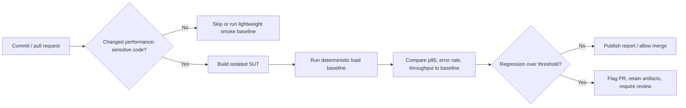

# HW05 Performance-Testing Report

**Student ID:** `23127172`  
**Repository:** `https://github.com/Jiduckiess/HW05`  
**Date:** `2026-08-15`  
**SUT revision:** `eshop-sut commit 85af3ba`

## 1. Environment and evidence

| Item | Value / evidence |
| --- | --- |
| SUT and backend base URL | `https://github.com/ttbhanh/eshop-sut`, backend `http://localhost:3000` |
| JMeter version | Apache JMeter 5.6.3 |
| OS / CPU / RAM / hostname | macOS 26.6.1 / Apple M4 Pro (14-inch MacBook Pro) / 24 GB unified memory / 512 GB SSD / hostname: `Jiduckiess` |
| Resource monitor | macOS Activity Monitor, filtered by `node` |
| Test network conditions | Local machine: JMeter and backend ran on the same Mac. |

Hardware-spec evidence is `evidence/hardware/macbook-pro-m4-pro-specs.png`. Hostname evidence is the Terminal screenshot `evidence/hardware/hostname.png`, which shows `jiduckiess@192`; the local hostname is `Jiduckiess`. Resource-monitor evidence for the runs is in `evidence/`.

## 2. AI-assisted design and human review

### Scenario mapping rationale

| Scenario | Endpoint group and exact API/workflow | Why this pairing is suitable | AI suggestion reviewed | My correction and justification |
| --- | --- | --- | --- | --- |
| Load | Read-heavy: `GET /api/products?search=${search_term}` → `GET /api/products/${product_id}` | These are read requests and can be repeated safely with product data from the CSV. | AI-02 and AI-03 in the audit. | I checked the real query parameter is `search`; it must not be omitted from the sampler. |
| Stress | Auth-heavy: `POST /api/login` | Login is a separate authentication path and includes password verification. | AI-02 and AI-04 in the audit. | Valid accounts were used, so the three-invalid-login lockout behavior was not triggered in this run. |
| Spike | Transactional: login setup → `POST /api/cart` → `POST /api/checkout` | This is a state-changing workflow and needs the JWT returned by login. | AI-02 and AI-04 in the audit. | I verified the JSON token extraction and `Authorization: Bearer ${token}` header before running. |

### Final test-plan inventory

| Scenario | Required filename | Data file | Unique report view | Assertions / pass criteria |
| --- | --- | --- | --- | --- |
| Load | `23127172_Load_20260812.jmx` | `data/read-heavy_products.csv` | Summary Report | HTTP 200; raw JTL error rate 0.00%. |
| Stress | `23127172_Stress_20260812.jmx` | `data/auth-heavy_credentials.csv` | Aggregate Report | HTTP 200; raw JTL error rate 0.00%. |
| Spike | `23127172_Spike_20260812.jmx` | `data/transactional_orders.csv` | View Results Tree | HTTP 200 for login, cart and checkout; raw JTL error rate 0.00%. |

## 3. Execution results

### 3.1 Load — read-heavy

**Plan:** `test-plans/23127172_Load_20260812.jmx` · **raw log:** `results/load/23127172_Load_20260812.jtl` · **HTML report:** `results/load/html-report/` · **resource screenshot:** `evidence/load/load-summary-and-resource.png`

| Parameter | Value |
| --- | --- |
| Virtual users / threads | 10 |
| Ramp-up / duration / think time | 20 s / observed raw-log window 37.087 s / 1,000 ms |
| Samples / error rate | 200 / 0.00% (0 failed) |
| Throughput / p95 / max latency | 5.393 samples/s / 4 ms / 16 ms |
| CPU / memory observation | The combined JMeter/Activity Monitor evidence shows the active 11-thread backend Node process at 0.7% CPU at capture time. A separate backend-memory screenshot was not captured for this short run. |
| Verdict | Passed at this modest workload; this run does not establish a maximum capacity threshold. |

### 3.2 Stress — auth-heavy

**Plan:** `test-plans/23127172_Stress_20260812.jmx` · **raw log:** `results/stress/23127172_Stress_20260812.jtl` · **HTML report:** `results/stress/html-report/` · **resource screenshot:** `evidence/stress/stress-aggregate-and-resource.png`

Document lockout reset procedure: no reset was needed because all 100 requests used valid credentials and returned 200. If a lockout test is run later, reset the local seeded database with `node database.js`, then restart with `node server.js`; this deletes local test data and must be recorded as a separate test action.

| Parameter | Value |
| --- | --- |
| Virtual users / threads | 20 |
| Ramp-up / duration / think time | 30 s / observed raw-log window 30.508 s / 500 ms |
| Samples / error rate | 100 / 0.00% (0 failed) |
| Throughput / p95 / max latency | 3.278 samples/s / 5 ms / 24 ms |
| CPU / memory observation | The combined JMeter/Activity Monitor evidence shows the active 11-thread backend Node process at 0.7% CPU at capture time. A separate backend-memory screenshot was not captured for this short run. |
| Failure point and verdict | No failure point was reached at 20 users. All tested logins were valid; lockout was not triggered. This is a successful load level, not the stress threshold. |

### 3.3 Spike — transactional

**Plan:** `test-plans/23127172_Spike_20260812.jmx` · **raw log:** `results/spike/23127172_Spike_20260812.jtl` · **HTML report:** `results/spike/html-report/` · **resource screenshot:** `evidence/spike/spike-results-tree-and-resource.png`

| Parameter | Value |
| --- | --- |
| Baseline users → spike users | 0 → 30 users (the current plan has no explicit baseline stage) |
| Ramp-up / hold / recovery / think time | 5 s / no separate hold / no recovery stage / 500 ms |
| Samples / error rate | 180 (60 login, 60 cart, 60 checkout) / 0.00% (0 failed) |
| Throughput / p95 / max latency | 24.480 samples/s / 6 ms / 11 ms |
| CPU / memory observation | The combined JMeter/Activity Monitor evidence shows the active 11-thread backend Node process at 2.9% CPU at capture time. A separate backend-memory screenshot was not captured for this short run. |
| Recovery behaviour and verdict | All requests succeeded during the 7.353 s observed window. Recovery cannot be concluded because the plan does not reduce from a sustained spike to a baseline period. |

### 3.4 Endurance / soak result

Run 10–15 minutes at sustained load.

| Duration | Concurrency | Stable RPS | p95 | Error rate | Backend memory | Threshold conclusion |
| ---: | ---: | ---: | ---: | ---: | ---: | --- |
| 14.98 min (898.784 s) | 10 users | 9.657 samples/s overall; 9.889–9.950 samples/s during minutes 3–15 | 3 ms overall | 0.00% (0 / 8,680) | Backend Node PID 7537: 29.9–34.1 MB; peak 34.1 MB. CPU: 0.0–1.6%; peak 1.6%. | The system sustained this 10-user read-heavy workload without latency growth or errors. Therefore, the measured stable level is **at least 9.66 samples/s** on this hardware; it is not the maximum capacity because no higher sustained load was tested. |

**Execution artifact:** `test-plans/23127172_Endurance_20260812.jmx` executed 10 read-heavy virtual users with 60-second ramp-up and a 1-second think time. Its raw log is `results/endurance/23127172_Endurance_20260812.jtl` and the HTML report is `results/endurance/html-report/`. The measured duration was 898.784 seconds (14.98 minutes). Across 8,680 samples: mean = 1.580 ms, p95 = 3 ms, p99 = 3 ms, maximum = 18 ms, and error rate = 0.00%. The 3-minute intervals after ramp-up achieved 9.944, 9.950, 9.944, and 9.889 samples/s. Resource evidence is in `evidence/endurance/`.

| Elapsed time | Screenshot time | Backend Node PID 7537 CPU | Backend Node PID 7537 memory | Evidence |
| --- | --- | ---: | ---: | --- |
| 0 min | 16:11–16:12 | 0.0% | 29.9 MB | `endurance-00min-cpu.png`, `endurance-00min-memory.png` |
| 3 min | 16:14 | 1.3% | 32.8 MB | `endurance-03min-cpu.png`, `endurance-03min-memory.png` |
| 6 min | 16:17 | 1.5% | 34.1 MB | `endurance-06min-cpu.png`, `endurance-06min-memory.png` |
| 9 min | 16:20 | 1.3% | 32.8 MB | `endurance-09min-cpu.png`, `endurance-09min-memory.png` |
| 12 min | 16:23 | 1.1% | 32.6 MB | `endurance-12min-cpu.png`, `endurance-12min-memory.png` |
| 15 min | 16:26 | 1.6% | 32.3 MB | `endurance-15min-cpu.png`, `endurance-15min-memory.png` |

## 4. AI analysis and misinterpretation hunt

Link the complete AI output in `docs/03-ai-audit-report.md` and retain all raw `.jtl` files. Do not treat an aggregate-report number as a raw-log value without checking it.

| AI claim / recommendation | Correct raw `.jtl` value and how calculated | Why AI was wrong / incomplete | Final decision |
| --- | --- | --- | --- |
| “The short three scenario runs establish the hardware threshold.” | The short runs alone cannot establish it: Load p95 = 4 ms at 10 users; Stress p95 = 5 ms at 20 users; Spike p95 = 6 ms at 30 users; all 480 recorded samples succeeded. The endurance run adds evidence of stable 10-user load: 8,680 samples over 898.784 s, p95 = 3 ms, 0 errors, 9.657 samples/s. | A short run does not establish endurance. Conversely, an endurance run at one load proves a stable level, not the maximum capacity. | Report **at least 9.66 samples/s stable at 10 users**; progressively increase sustained users to find the maximum threshold. |
| “The Spike test proves recovery after the spike.” | The raw log spans only 7.353 s and the plan rises to 30 users in 5 s; it has no post-spike baseline interval. | Success at the peak is not evidence of recovery. | Add a baseline → spike → recovery schedule and compare p95/error rate in the final baseline period. |

### Optimization feasibility review

| AI optimization | Feasible or hallucinated? | Evidence from SUT / constraints | Action |
| --- | --- | --- | --- |
| Add a database index for product detail | Not needed / misleading for this result | `products.id` is already the SQLite primary key; product-detail p95 is 4 ms and has 0 errors. | Do not prioritize it. |
| Index product-name search | Conditionally feasible, but not evidenced now | The SUT executes `WHERE name LIKE '%${searchQuery}%'`; a normal B-tree index generally will not help a leading-wildcard search. The seed database has only five products and search p95 is 4 ms. | First use parameterized search; revisit with pagination/FTS after profiling a realistic product volume. |
| Add a connection pool | Hallucinated / unsuitable for this SUT at present | The backend uses one local Node `sqlite3.Database` connection to SQLite, not a network database. No connection-wait metric or saturation appears in the logs. | Do not implement without changing architecture and measuring a real contention bottleneck. |
| Enable SQLite WAL | Feasible but unproven | SQLite supports WAL, but these runs show no write contention (0 errors; checkout p95 6 ms). | Benchmark it separately before adopting; document durability/concurrency trade-offs. |
| Paginate product listing | Feasible scalability improvement, not a current bottleneck | `GET /api/products` selects all products; with five seeded rows the measured search p95 is only 4 ms. | Add only when catalogue size/load testing demonstrates payload/query growth. |

## 5. Continuous performance-testing proposal

**Suggested guardrails:** Run the Load plan on each pull request. Compare the result with a stored baseline only when there are at least 100 samples. Flag the pull request if error rate is above 1%, or if p95 rises more than 15% *and* more than 10 ms. Run the longer endurance plan nightly or before release, not on every commit.

**Trade-offs:** A local runner is cheap but results can change when other applications use the Mac. A fixed seed database and the same JMeter version reduce noise, but baselines still need review after an intentional performance change. The full endurance test takes about 15 minutes, so it is better scheduled than run for every small commit.

## 6. Issues and demo

- GitHub Issues: No performance bug was filed. The completed workloads had 0.00% errors; the missing spike recovery stage is recorded as a test-design limitation, not a confirmed SUT bug.
- Demo video (unlisted, Vietnamese narration, ≥6 min): **Pending upload.**
- The video shows JMeter/k6 and the resource monitor in the same frame: **Pending recording.**

## 7. Conclusion

All three configured scenarios completed without request errors. The highest short-run throughput was the 30-user transactional spike at 24.480 samples/s, but it had no recovery stage, so it cannot prove post-spike recovery. The 10-user endurance plan was stable for 14.98 minutes at at least 9.66 samples/s, p95 3 ms, and backend memory between 29.9 and 34.1 MB. This is the measured stable level for the tested workload, not the maximum capacity of the laptop or SUT. The next useful test is a longer read-heavy plan with progressively higher sustained user counts and a spike plan that includes baseline, spike, and recovery periods.

See also: [AI audit](03-ai-audit-report.md), [AI critique](04-ai-critique.md), and [commit log](../git-commit-log.txt).
